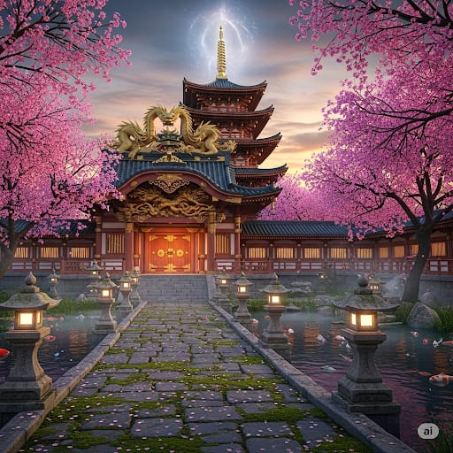

---
tags:
  - location
aliases:
  - 鳥居
---
Grande monte che torreggia al centro del Honshu, nella regione del [[Kanto]].
Alle sue pendici sud, si trova un tempio, conteso dalle regione del [[Kanto]] e [[Chuugoku]].
All'interno del tempio, il clan [[Mori]] ha effettuato il rituale di evocazione degli eroi delle Armi Divine.
