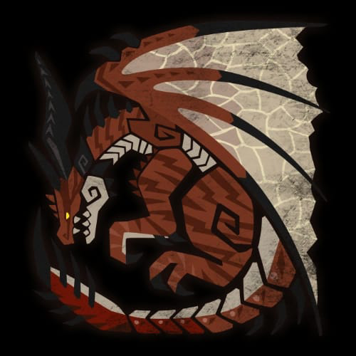
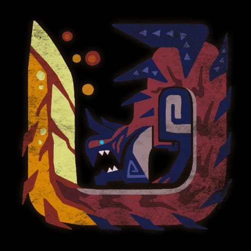
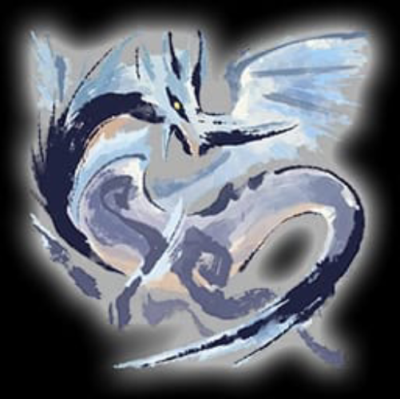
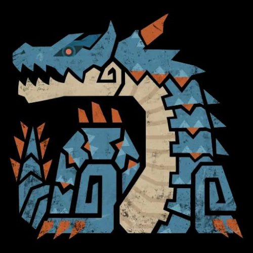
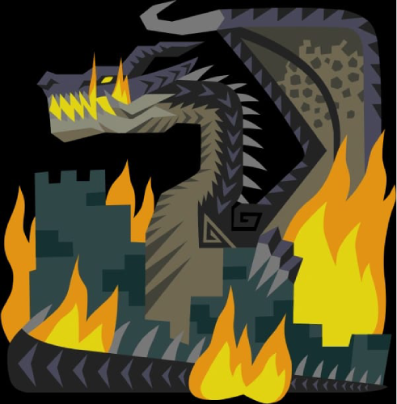

---
tags:
  - lore
---
# Draghi Leggendari

Potenti creature che, secondo le leggende, hanno creato [Ryūtsuchi](Ryuutsuchi.md). Sono creature viventi che risiedono nel piano materiale, ma la loro potenza è tale che sono state venerate come divinità dalle tribù antiche. Poco si sa sul loro conto, in quanto si mostrano solo quando necessario.
Le creature venerate come divinità sono 6. Oltre a loro, si narra di un essere tanto più potente quanto spaventoso e feroce, che lascia solo devastazione e morte al suo passaggio.

Pare che i sei siano nati in concomitanza con il [Cataclisma](Cataclisma.md) che ha messo fine alla corruzione creata da [Nani](Nani.md) e [Gnomi](Gnomi.md).

## Safi'jiiva

Drago rosso. Vive sul [Monte Torii](Monte%20Torii.md), nella regione di [Tsukigamine](Tsukigamine.md).

Appare come un punto dorato sulla [Mappa](Mappa.md).

## Glavenus

Vive tra i vulcani di [Kanzaretsu](Kanzaretsu.md). Si sposta su due zampe e lascia dietro di se una scia di fuoco. Chiamato con l'appellativo di *Montagna Tonante*.

Appare come un punto rosso sulla [Mappa](Mappa.md).

## Velkana

Vive nella tundra di [Hyosetsu](Hyosetsu.md). Rimane nascosto tra le folate di neve.

Appare come un punto bianco sulla [Mappa](Mappa.md).

## Diablos Nera

Nuota nelle sabbie di [Sabakuro](Sabakuro.md), spostando una collina di sabbia sopra di se.

Appare come un punto nero sulla [Mappa](Mappa.md).

## Lagiacrus

Protettore di mari e correnti. Normalmente non ostile, dove va porta una tempesta. Vive nell'arcipelago di [Shinkai no Kuni](Shinkai%20no%20Kuni.md)

Appare come un punto blu sulla [Mappa](Mappa.md).

## Mizutsune

Associato ad un'illusione dai colori viola e perlacei. La sua forma non è nota. Visita le rive e i laghi cristallini di [Moriya](Moriya.md).

Appare come un punto verde sulla [Mappa](Mappa.md). Il punto si sposta di frequente, nella valle del [Monte Torii](Monte%20Torii.md), a [Murasame](Murasame.md), e nei pressi degli altri draghi.

## Fatalis

Drago che dove passa fa appassire la vita. Associato a montagne e tempeste. È il più potente dei draghi. Chiamato *Catastrofe Imminente* nelle leggende.

Non appare sulla [Mappa](Mappa.md).
