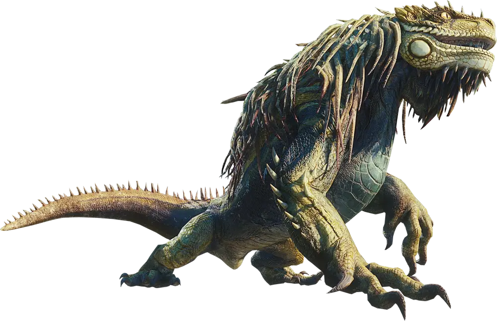

---
tags:
  - monster
---
# Gran Jagras

Grande [Wyvern](Wyvern.md) rettile somigliante ad un'iguana. Di colore verde, cammina su quattro lunghe zampe, e ha una lunga criniera. Presenta una grande sacca elastica sotto la gola, dove avviene la digestione di tutto ciò che ingoia. Quando si sente in pericolo e in grado di rigettare il suo ultimo pasto, semi digerito, come un potente attacco ad area.

Un esemplare si trovava nella [Foresta](Shinkai%20no%20Kuni.md#foresta), poi ucciso dagli Eroi.

## Informazioni di gioco

- Punti Ferita: > 100
- Classe Armatura: 14-15 (armatura naturale)
- Velocità: ?
- Grado Sfida: 5 (1800xp)
- Competenze: ?
- Resistenza: danni Contundenti da armi non magiche
- Immunità: ?

| STR | DEX | CON | INT    | WIS | CHA |
| --- | --- | --- | ------ | --- | --- |
| ?   | ?   | ?   | 3 (-4) | ?   | ?   |
