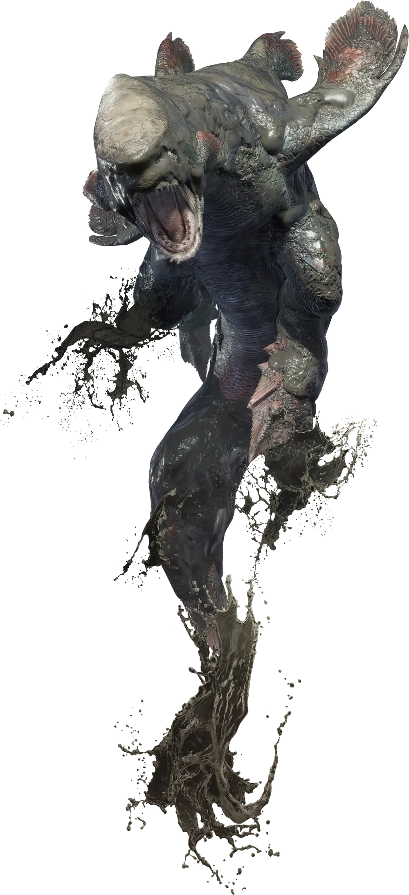

---
tags:
  - monster
---
# Jyuratodus

[[Wyvern]] anfibio che predilige tane in prossimità di baie e golfi. Normalmente avvistato nelle coste paludose di [[Sabakuro]].

Un esemplare si risveglia nei pressi della Residenza. Sembra che tempo addietro abbia attaccato [[Murasame]].

## Informazioni di gioco

- Punti Ferita: ?
- Classe Armatura: ?
- Velocità: 18m
- Grado Sfida: ?
- Competenze: ?
- Resistenza: ?
- Immunità: ?

| STR | DEX | CON | INT | WIS | CHA |
| --- | --- | --- | --- | --- | --- |
| ?   | ?   | ?   | ?   | ?   | ?   |
