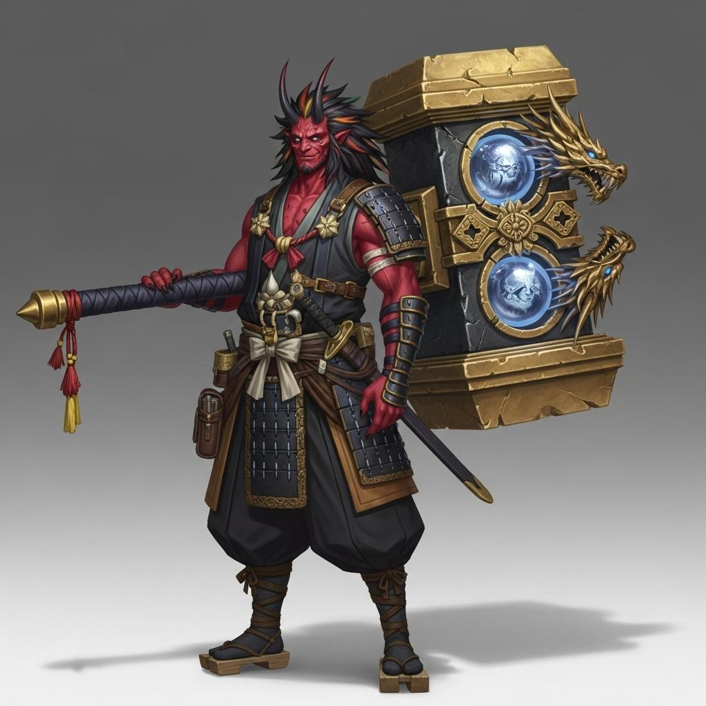

---
tags:
  - character
aliases:
  - Mizuhara Riro
  - 水柄リーロ
---
# Mizuhara

| Giocatore | Razza | Classe     |
| --------- | ----- | ---------- |
| Giacomo   | Oni   | Artefice 3 |

Uno degli eroi delle Armi Divine. Portatore di [[#Outsuchi]]. Evocato come [[Oni]].
## Outsuchi

Grosso martello in legno. Nella parte centrale della testa c'è una sfera di vetro, che tramite l'incantesimo Assorbire Elemento si carica, per poi sprigionare il danno elementale.
