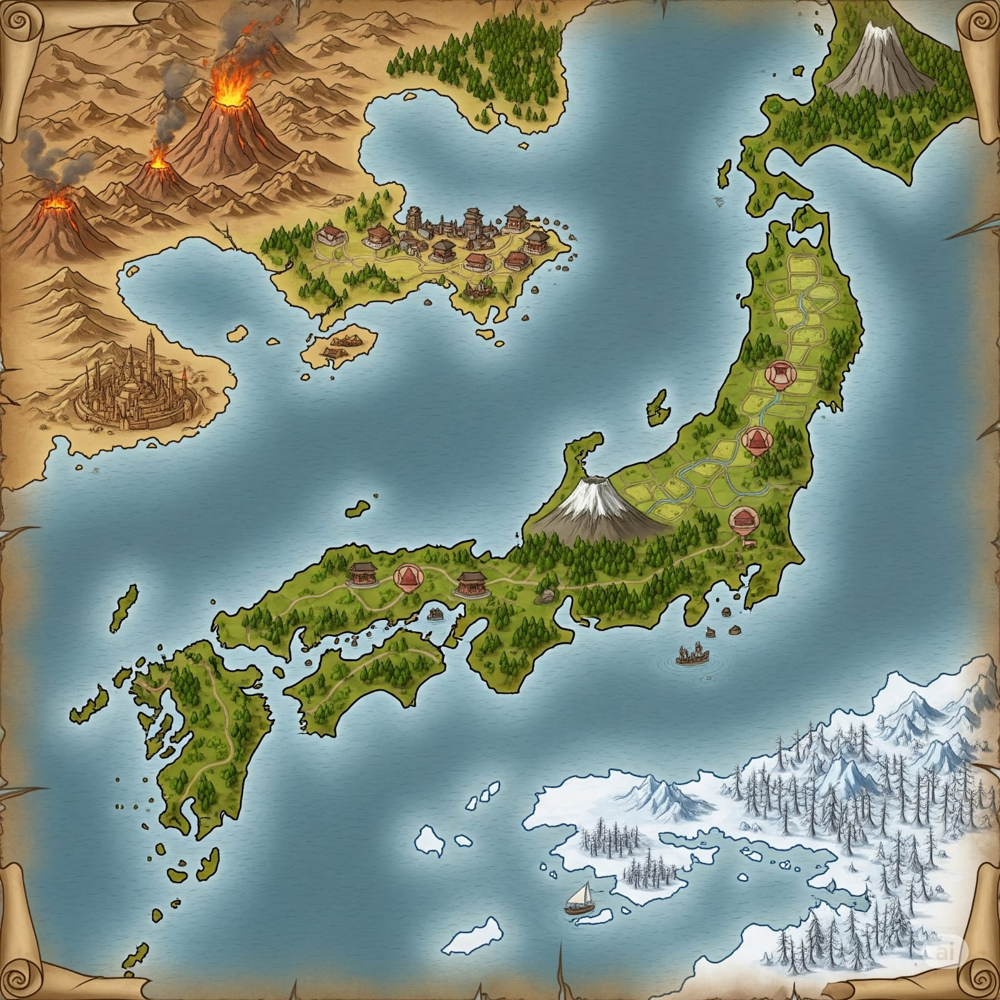

---
tags:
  - location
  - lore
aliases:
  - 竜土
  - Ryūtsuchi
---
# Ryūtsuchi

## Geografia e divisione politica

Continente diviso in 3 parti:

- [Terra vulcanica](#terra-vulcanica) a nord-ovest
- [Terra artica](#terra-artica) a sud-est
- [Terra pianeggiante boschiva](#terra-pianeggiante-boschiva) al centro

Nell'ambientazione, [[Nani]] e [[Gnomi]] sono quasi estinti.

### Terra vulcanica

Terra calda al nord ovest del continente, separata dal mare dal resto.

Una penisola densamente popolata, sede della famiglia imperiale, fuggita dalla [Terra pianeggiante boschiva](#terra-pianeggiante-boschiva) per rimanere al sicuro dalla minaccia delle [[Wyvern]].
La città è considerata sicura perché costruita sopra un'intricata rete di tunnel e gallerie, che fungono da riparo in caso di attacco.

Una piccola isola sulla costa è la via d'accesso per l'[[Underdark]], dove vivono i [[Drow]].

La regione del [[Kanzaretsu]] comprende una catena montuosa di vulcani, casa di comunità di [[Dragonidi]].

La costa meridionale è la regione di [[Sabakuro]], desertica nell'entroterra e paludosa lungo le coste. Una città di una civiltà perduta offre riparo ai [[Tiefling]].

### Terra artica

Regione chiamata [[Hyosetsu]]. Terra fredda a sud del continente, caratterizzata da venti gelidi e neve perenne.

La terraferma è abitata dai [[Tabaxi]], un popolo generalmente poco apprezzato dalle altre razze per la poca fiducia che si può riporre in loro.

Il golfo è abitato dai [[Tritoni]].

Tra Tabaxi e Tritoni non scorre buon sangue, e sono spesso in disputa.

### Terra pianeggiante boschiva

Arcipelago centrale del continente, di forma simile al Giappone, ma più grande di dimensioni (10 volte #fixme).

Diviso in 3 regioni principali, da nord a sud:

- [[Moriya]], del clan #missing 
- [[Tsukigamine]], del clan #missing 
- [[Shinkai no Kuni]], del clan [[Mori]]

Moriya è abitata principalmente da [[Elfi Silvani]]. È presente un grande vulcano al centro dell'isola.  
Nello Shinkai e nello Tsukigamine abitano principalmente [[Umani]] e [[Halfling]]. Gli Halfling sono un popolo nomade. Più di recente sono state annesse le tribù di [[Oni]] e [[Goblin]] delle isole a sud, contro le quali in passato si erano svolti diversi scontri.

## Cultura

Si parlano principalmente due lingue, che corrispondono vagamente al giapponese del mondo reale:

- Comune antico
- Comune moderno

Ognuno parla anche la lingua comune alla propria razza; possono essere ceppi distinti, o dialetti di una lingua più comune.
