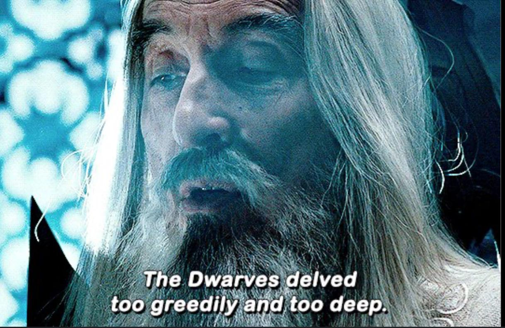

# Sessione 13

*2026-04-04*

La [Kitsune](../Draghi%20Leggendari.md#mizutsune) demanda che gli "Eroi" facciano una scelta, da che parte stare. [Izumi](../Izumi.md) riesce a convincerla a fornirgli più informazioni riguardo la storia del mondo, e le presunte menzogne riguardo al loro compito raccontate dal Daimyo del clan [Mori](../Mori.md).

## La Verità

Nell'[Epoca che fu](../Epoca%20che%20fu.md), i [Nani](../Nani.md) e gli [Gnomi](../Gnomi.md) erano prosperi nel mondo, ma si lasciarono prendere da  avidità e potere. Hanno cominciato a prosciugare le risorse e le energie del mondo per raggiungere i loro scopi di dominio. Mossero guerre tra di loro, e in questo frangente crearono quelle che ora sono le [Armi Divine](../Armi%20Divine.md). L'utilizzo di queste armi causa la morte del mondo, che si manifesta con marcescenza e corruzione della natura.

Ma, tutto questo fu risolto, una volta, con il [Cataclisma](../Cataclisma.md): Nani e Gnomi furono spazzati via, lasciati sull'orlo dell'estinzione. Le altre razze nascenti in quel periodo cominciarono a venerare come divinità le [sei creature](../Draghi%20Leggendari.md) nate a seguito del cataclisma.  
Il clan Mori, animato dalle stesse emozioni che pervasero Nani e Gnomi all'epoca, ha effettuato un rituale di evocazione esoterico, chiamando a sé 3 eroi e legando le loro anime alle armi di distruzione definendole "divine", con lo scopo di aggiungerli al suo esercito e muovere guerra contro i popoli vicini.  
La storia sui [Wyvern](../Wyvern.md) e la missione di indagare sul loro risveglio era una bufala inventata per tenere gli eroi occupati, anche passivamente e senza il loro consenso, in attività a supporto della guerra. Ma il piano sembra essere stato fermato dal [Fatalis](../Draghi%20Leggendari.md#fatalis), che ha raso al suolo l'intera città di [Murasame](../Murasame.md).  
La corruzione attualmente presente nel mondo e incontrata dal gruppo durante il loro viaggio verso il [tempio del Monte Torii](../Monte%20Torii.md#tempio) è causata dalle Armi Divine, se chi le usa porta in sé la volontà di distruggere e prevalere.

La Kitsune domanda quindi a [Riro](../Riro.md) e Izumi se staranno dalla parte degli uomini, della distruzione e della corruzione, o dalla parte della vita e della natura. Senza attendere una risposta chiara, li invita a visitare il [Glavenus](../Draghi%20Leggendari.md#glavenus) nel [Kanzaretsu](../Kanzaretsu.md), dopodiché se ne va, lasciando i due in compagnia di [Vahltrax](../Vahltrax.md).

## Il viaggio continua

Lasciati soli nella sala di evocazione, Izumi cerca sulla [Mappa](../Mappa.md) una rotta per il Kanzaretsu. Nota però che il punto dorato che indica la posizione del [Safi'jiiva](../Draghi%20Leggendari.md#safijiiva) si sposta velocemente dalla cima della montagna verso il tempio, per cui decidono di andarsene il prima possibile, non conoscendo le intenzioni del drago.

Per dirigersi nel Kanzaretsu, decidono di partire da [Toriyu](../Toriyu.md), una città portuale di [Shinkai no Kuni](../Shinkai%20no%20Kuni.md). Passano dalla [Residenza](../Residenza.md), e utilizzano il teletrasporto verso la [Foresta](../Shinkai%20no%20Kuni.md#foresta), ora funzionante perché Vahltrax è con loro, per ridurre la lunghezza del viaggio.

Il terreno della foresta è pieno di grandi impronte. Il gruppo è attaccato dal proprietario di tali impronte, un [Anjanath](../Anjanath.md). Vahltrax aiuta nello scontro quando gli altri due sono in difficoltà, quasi a metterli alla prova. Riro sviene, e Valhtrax sconfigge il dinosauro con un attacco necrotico.
